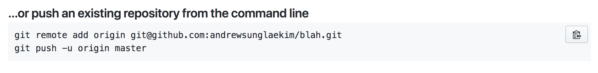
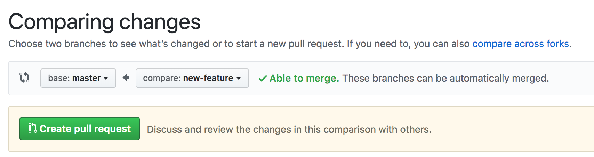

# Git Workshop

## Preferred Requirements

- Basic CLI
- a github account

## Learning Objectives (5/5)

- Define version control and identify what problems it solves for developers
- Define a repository (aka repo) is, and identify what the parts of a repo are
- Create a git repository
- Create a git branch
- Identify the purpose of the staging area
- Stage changes
- Commit changes
- Resolve merge conflicts
- Reset git commits
- Differentiate between a local repository and a remote repository
- Synchronize a local repository with a remote repository using git with Github


## Framing (5/10)

Simply put, version control is a way of *tracking changes* made to a file or group of files over time.

It's very likely that each of us has tried to keep track of changes made to a file by creating different versions of that file. This however can be messy or complicated especially when working in teams.

### Think Pair Share 5/15

Think about the following questions for 2 minutes:

- What are some reasons we might want different versions of a project?
- What are some strategies you've used in the past? (outside of VC)
- What problems, if any, did you encounter?
- How can version control software be leveraged to solve these problems?
- If you use git already, how has it helped you? what do you wish it could do better?

Then share with someone sitting next to you about your thoughts for 3 minutes.

## Git - Git solves problems. 5/20
- I wrote some code to implement a feature, but I broke a bunch of stuff in the process. **I want to be able to go back in time to a point where my code works!**
- I'm trying to see how my codebase or some files have changed over time. **I'd like to be able to compare various states of my files.**
- I want to work on someone else's project, but don't want to break their code and ruin everything. **I want to have my own 'area' where I can try out code or build out a feature without adversely affecting another developer's project I'm working on.**
- I'm working on a project with a team, and **I want to have an easy way to collaborate with my team**

## Git - Some basic definitions

- Git - It is version control software. Today we'll be using the CLI to use git.
- Repositories - Git stores information about a project in a data structure called a repository.
- Commit - records changes to the repository
- Branch - A branch in Git is simply a lightweight movable pointer to one of these commits.
- the index - also called the staging area. It is where we add changes to be committed

> There will be more definitions, we'll spread them throughout the lesson but also conglomerate them into an appendix at the bottom of this lesson.

> Another note about today's workshop. There are many IDE's out there that allow us to do various git tasks a bit more efficiently for us than the CLI. The intent of this workshop is to familiarize us with what's happening with git underneath all the IDE niceties.

## Local git - We do (5/25)
Lets GIT started .... open your terminal.

Creating a git repository:

```bash
$ mkdir git_workshop
$ cd git_workshop
$ git init
```

> You can name the folder whatever you would like. `$` will be used to indicate the start of the command prompt

You should see something like this:

```
Initialized empty Git repository in /Path/to/git_workshop/.git/
```

> This created a git repository for us in the `git_workshop` directory.

Create a file and add some content to it:

```bash
$ touch hello.txt
$ echo "hello" > hello.txt
$ git status
```

Stage it:

```bash
$ git add hello.txt
$ git status
```

### `git status`

`git status` is a command to get an overview of changes we've made to our working tree. It shows us if files have changed from the current version and additionally whether those changes have been sent to the index("staged") or not.

> We first need to stage changes before committing them. Only the staged changes get committed.

### The index

The index is the place we place the revisions in our files before we `commit` them to the repository.

Why should we stage things? It's hard to see as we currently are only staging 1 file at this time. Imagine we were in a code base where we've made 20 revisions to several file. What if we only want some of those changes to be saved. It'd be really nice to be able save some of the changes but discard the rest.

### Committing
Committing changes essentially "saves" a version of your code.

Commit it:

```bash
$ git commit -m "git init; adds hello.txt"
```

> Commit commands must always be accompanied by a commit message. Generally try to write commit messages in the imperative. As when you check out to a commit, you are "executing" that commit message

## Branching (5/30)

We're successfully tracking our extremely complicated project in git. As developers, we like to keep places in our projects that are "pristine" and protect it through code reviews. Every team probably practices these workflows a bit differently, but everyone uses branches in order to solve this problem.

Branches quite literally point to a commit. They will be a place we can track the history of our `feature` branch separate from `master`.

Turns out we can branch locally as well. Creating a git branch using `git checkout -b branch-name`:

```bash
$ git checkout -b feature-update-hello
```

> `feature-update-hello` is the name of the new branch were checking out from the master branch.

We can now checkout to whichever branch we want to be in:

```
$ git checkout master
$ git checkout feature-update-hello
```

> Make sure you are in the `feature-update-hello` branch before moving on.

### <a name="commitYouDo"></a>You do - Commit a change to `hello.txt` (10/40)

- Make edits to `hello.txt`
- Stage the changes
- Commit the changes

### Git diff aside

- Make another change to `hello.txt`
- **Before staging and committing** Run this command:
```
$ git diff
```

What does git diff do?

> Don't forget to finish staging and committing after `git diff`

## Merging - We do (10/50)
Let's say we've got some good things going with our `feature` branch and we want those things in `master`.

How do we merge our changes with the `master` branch? `git merge`

```bash
$ git checkout master
$ git merge feature-update-hello
```

you should see something like this depending on what you edited:

```
Updating bd9e339..c9f4b8c
Fast-forward
 hello.txt | 1 +
 1 file changed, 1 insertion(+)
```

## Git logs (5/55)

We've made a couple of commits at this point. In order to see a history of the changes we've made, we can run `git log`

```
$ git log
commit c9f4b8c355e2604149e4a6a20d7e042507cb9cac
Author: Andy <andrew.sunglae.kim@gmail.com>
Date:   Sun Feb 18 22:22:00 2018 -0500

    updates

commit bd9e339bf4242c7fd47c3e8b89af917ffee57503
Author: Andy <andrew.sunglae.kim@gmail.com>
Date:   Sun Feb 18 22:21:37 2018 -0500

    initial commit

```

It may look different than yours, but the same types of information are present.

In reverse chronological order(most recent commits first) each commit contains:
- git SHA-1 checksum
- author's name and email
- Date
- commit message

> Check out the end of the lesson plan for a quick reference on how to pretty the PS1.

The important thing to note here is the `git SHA-1 checksum` but that's getting troublesome to say, so we'll say git SHA from here on out. In more or less words, it is a unique pointer to a snapshot in your projects history. We won't use this immediately, but we'll reference back to this when we revert commits.

## MERGE CONFLICTS (15/70)

> Stop. Take a breath. Don't run. Don't be afraid. Except ... be a little afraid.

Merge conflicts are a reality of development. They will happen and frequently.

First off, How do merge conflicts occur? They occur when two branches are merging and both branches have changes to the same file(s).

## We do - CREATE THE CONFLICT

> In this classroom setting, we are faking a merge conflict. The following is how to create a merge conflict, but should be noted that we won't do/see something like this in the event an actual merge conflict might arise.

Since we have recently merged `feature-update-hello`. The history of `master` and `feature-update-hello` should be identical.

```
$ git checkout master
$ echo "master changes" > hello.txt
$ git add hello.txt
$ git commit -m "changes hello.txt with master changes"
$ git checkout feature-update-hello
$ echo "feature branch changes" > hello.txt
$ git add hello.txt
$ git commit -m "changes hello.txt with feature branch changes"
$ git checkout master
$ git merge feature-update-hello
```
> **Don't** do this step in an actual merge conflict.

If you open `hello.txt` you can see the conflict. It should look something like this:

```
<<<<<<< HEAD
master changes
=======
feature branch changes
>>>>>>> test
```

Let's say we wanted to keep master's changes. We just delete all the conflict text (ie. `<`, `>` `=`). And delete any feature branch text. So we would be left with:

```
master changes
```

> You can literally change the file to anything. Most of the time we'll choose 1 side over another rather than putting brand new code.

We resolve the conflict by staging and committing the fixed file(the one that had the conflict).

```bash
$ git add hello.txt
$ git commit -m "fixes merge conflict in hello.txt"
```

## Reset - You do (10/80)
There are lots of ways to change the HEAD or the history of a branch.

### Definitions
`HEAD` - the current branch

`checkout` - switch branches or restore working tree files

`reset` - resets the current HEAD to the specified state

`revert` - revert the changes that the related patches introduce, records new commits.

The one we'll use today is `reset`. The most common use case for `reset` is doing work locally and wanting to rewind the work you've done

> We plan on going into a lot more detail into commands like this one in a more advanced git workshop. Where we'll see the differences between `checkout`, `reset`, and `revert`.

### ** \*DANGER\* ** The following can delete your history.
You would only use this to remove part of your history.

Let's say we we're working on a feature. We've realized 3 commits in that we've totally botched the architecture and want to rewind those last 3 commits. We might do something like this(Don't do this if you're just reading along):

```
//** WARNING: this will delete history **/
$ git reset --hard HEAD~3
```

This will rewind the `HEAD` 3 commits. Meaning you will LOSE those commits in history(mostly). If we are thinking about using this command, we need to definitively know why we are using it. It never hurts to ask someone before doing a command like the one above.

> the `hard` flag has to do with how the reset effects the index and working tree. It resets them. `HEAD~3` is where the working tree will reset to, in this case 3 commits behind the current `HEAD`.

### You do (10/90)
Make 3 commits, follow the directions from the [above](#commitYouDo) commit section if you are unsure what to do. Doesn't matter what the content is since we will be rewinding it.

Then run:
```
$ git reset --hard HEAD~3
```

> You should be exactly where you started.

## Remote Repositories
Everything we've done thus far has been done on our computers, in a *local* repository. Remote repositories live in places that are not our local machine. Hosting services, like Github and Bitbucket, allow us to place our repositories on the internet.

Run the following command:
```
git remote -v
```

If you've been following along from the beginning then you should see ... nothing. `git remote -v` lists all of our remote connections. Since we don't have any yet, we don't see any yet. Let's fix that.

- Navigate to [Github](https://github.com/).
- Log in to your personal account.
- Click on the plus sign in the top right, then click 'New Repository'
- Fill in Repository name with `github_workshop` or whatever your folder name is. It literally can be whatever you want, but for consistency it should be the same as your local repositories working directory.
- Click 'Create repository'

At this point we have created a brand new empty git repository on Github. We want to connect our local repository(our machine) to the remote repository(github).

In the middle of this screen you should see an option to do something like this only it will have your username and a different repository name:



To add the repository we just made on Github to our local repository. Let's run that first command:

```
$ git remote add origin git@github.com:someUserName/git_workshop.git
```

> if you don't have SSH setup, [check this out](https://help.github.com/articles/adding-a-new-ssh-key-to-your-github-account/)

This adds a remote connection from the local repository on our computer to the remote repository we just created on Github. If you run `git remote -v` now. You may see something like this:

```
$ git remote -v
origin	git@github.com:someUserName/git_workshop.git (fetch)
origin	git@github.com:someUserName/git_workshop.git (push)
```

Then run the next command Github gives us:

```
$ git push -u origin master
```

> Wow! Our code is available online and anyone can access it given the url.

This will set the default push to origin(remote name) master(branch name). This will make the once empty repository on Github, and more or less change it to a cloned version of your local repository.

We now have our code living in two places. `local` on our machines and a `remote` one living on github.

Another developer comes along and says, 'Hey, I would like to develop on the [git_workshop](https://github.com/andrewsunglaekim/git_workshop) as well'

Let's stop a moment. Consider what we've learned so far. Stop and think about the following questions for 2 minutes

- How many copies of this repository will exist when a second developer joins you?
- How might branching help alleviate some headaches in communication between you and another developer?

Now pair and chat about your answers for the next 3 minutes.

## The Holy War - Git Workflows (10/100)
There are holy wars fought over so many things in programming. Git workflows is definitely one that many have strong opinions about. Regardless of stance, here's a quick pattern that illustrates some of the key features with github.

> We are now the new developer that came along and said "Hey, I would like to develop on the [git_workshop](https://github.com/andrewsunglaekim/git_workshop) as well". You can follow along by going into some different directory, something like this: `$ mkdir ~/temp && cd ~/temp`

We want to contribute to git_workshop so we clone the repository that we created earlier on github.

```
$ git clone git@github.com:yourUsername/git_workshop.git
$ cd git_workshop
```


It is often a good idea to keep certain branches clean. Testing and production branches are good examples. The idea is that no one should be able to push directly to these branches. In any case, `master` will be our clean branch. So in order to contribute I would need to push to a different branch.

```
$ git checkout -b new-feature
$ echo "this will be the PR" > hello.txt
$ git add hello.txt
$ git commit -m "changes text for PR"
$ git push origin new-feature
```

The only thing new here is the last line, and we've seen this before as well. `git push origin new-feature` will push the current branch that we are on to `origin`(remote repository) `new-feature`(branch name)

Then we submit a pull request on Github's interface.

- click on the Pull requests tab
- click on New Pull request



- make sure the left branch(base) is `master` and the right branch(compare) is `new-feature`
- click Create pull request then again.

Now we can go in and merge the PR.

> If we unsure the `new-feature` branch is not up to date with `master` when we are pushing, then we need to make sure we pull in remote changes using `$ git pull` before pushing.

Always make sure your `feature` branch is up to date with whatever the clean version of your code.

## Final collaboration - You do (15/115)

Find a partner, if you don't have one, find an existing pair to work with.

> The series of directions will have `Person A` and `Person B` do certain things with version control. One of you will be `Person A` and one will be `Person B` if you have time, consider switching and doing the exercise again.

- `Person A` creates a local git repository
- `Person A` commits some changes to the repository
- `Person A` creates a remote repository
- `Person A` pushes local repository to remote repository
- `Person B` clones the remote repository to their local machine
- `Person B` checks out to a different branch
- `Person B` commits changes
- `Person B` pushes changes to the remote repository's branch
> you may need to add your partner as a collaborator, check your settings under your project repo.

- `Person B` submits pull request
- `Person A` accepts/rejects pull request

## Questions (5/120)

## Additional Info

### [Setting up SSH](https://help.github.com/articles/adding-a-new-ssh-key-to-your-github-account/)
### [Pretty PS1 prompt](https://coderwall.com/p/pn8f0g/show-your-git-status-and-branch-in-color-at-the-command-prompt)

## Appendix - Definitions
- Git - It is version control software. Today we'll be using the CLI to use git.
- Repositories - Git stores information about a project in a data structure called a repository.
- Commit - records changes to the repository
- Branch - A branch in Git is simply a lightweight movable pointer to one of these commits.
- the index - also called the staging area. It is where we add changes to be committed
- checkout - changing branches, moving the pointer to a different git sha
- merge - combine branches
- git SHA - unique identifier for a commit
- merge conflict - When two branches that are merging have changes to the same file(s)
- HEAD - the current branch
- reset - resets current HEAD to specified state
- revert - revert the changes that the related patch introduces, then records new commits.
- remote(repo) - Remote repositories are versions of your project that are hosted on the Internet or network somewhere.
- origin - an alias for a remote repository, it can literally be called anything else and would work the same way. There are no requirement to name a remote repository origin.
